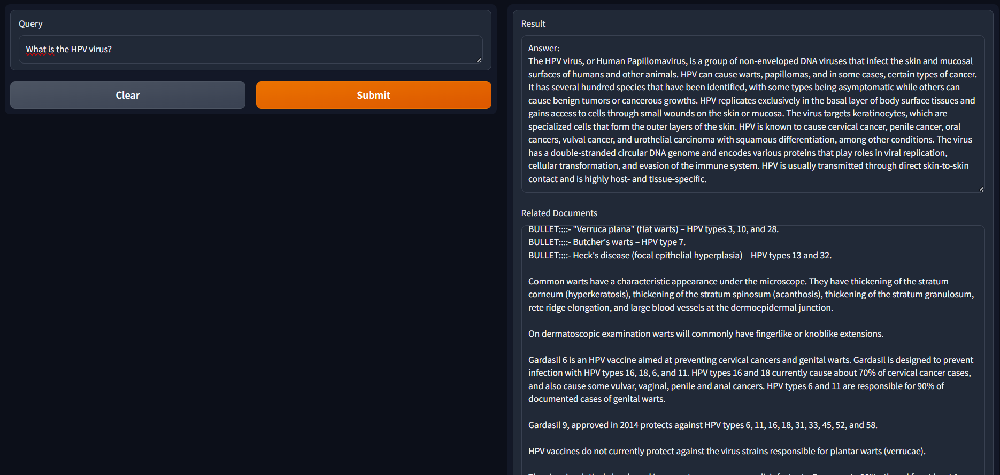
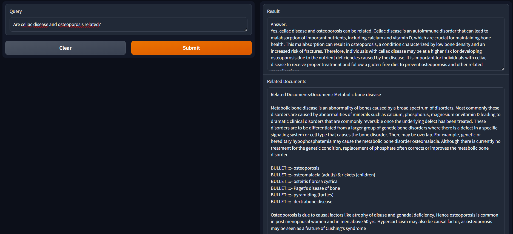

# RIKO

## environment
virtualenv venv && source venv/bin/activate
pip install -r requirements.txt

set OPENAI_API_KEY=sk-<your openai key>

## start DB
you will need to place apoc-5.16.1-core.jar in the plugins folder (wget https://github.com/neo4j/apoc/releases/download/5.16.1/apoc-5.16.1-core.jar)

docker compose up -d

## data preparation

Fetch data at https://zenodo.org/records/5755155, WikiMed dataset

run haystack_indexing

run haystack_addtag

## Run application
python -m app.app

Ask your questions!

## Feel free to get in touch with me for a live demo at raffaele.olmeda@intellico.ai

## Some ScreenShots  of the Demo

